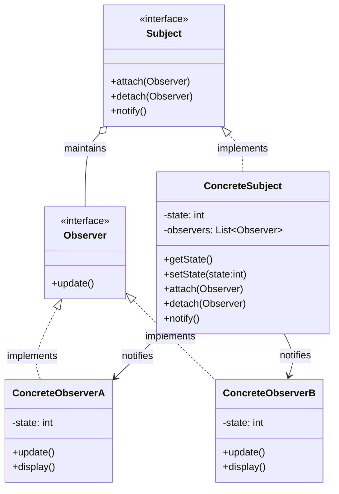

# Observer Design Pattern

This project demonstrates the **Observer Design Pattern**, a behavioral design pattern where an object (the subject) maintains a list of its dependents (observers) and notifies them of any state changes, typically by calling one of their methods.

## How It Works

1. **Subject**: Maintains a list of observers and provides methods to add, remove, and notify them.
2. **Observer**: Defines an interface for objects that should be notified of changes in the subject.
3. **ConcreteSubject**: Implements the subject interface and stores the state of interest.
4. **ConcreteObserver**: Implements the observer interface and updates its state to match the subject.

## Class Diagram

